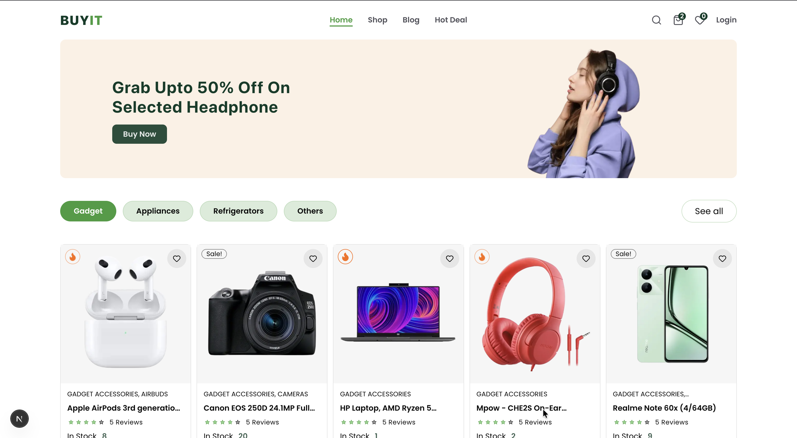
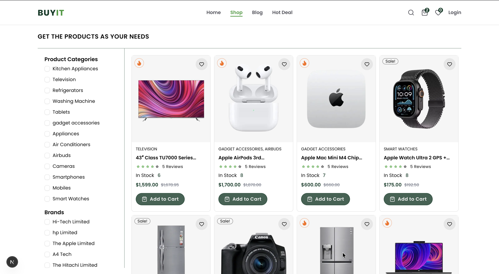
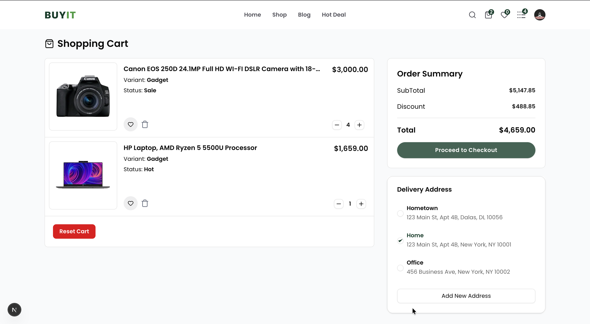

Here is the updated code for your `README.md`. I have polished the structure, added professional badges, organized the technical details into tables, and improved the installation flow to make it look like a high-tier open-source project.

You can copy and paste this directly into your file:

```markdown
# 🛒 BuyIT | Full-Stack E-Commerce Solution

BuyIT is a high-performance e-commerce platform built for the modern web. It features a seamless shopping experience, secure checkout, and a robust content management system.

[](https://buy-it-silk.vercel.app/)
[](https://nextjs.org/)
[](https://stripe.com/)

---

## ✨ Features

* **🔐 Secure Authentication:** Managed via Clerk for a frictionless login experience.
* **🛍️ Dynamic Storefront:** Real-time product management using Sanity CMS.
* **💳 Global Payments:** Integrated Stripe Checkout with automated webhook handling.
* **📱 Fully Responsive:** Optimized for mobile, tablet, and desktop views with TailwindCSS.
* **🚀 Type Safety:** Built with TypeScript and auto-generated Sanity schemas.
* **📑 Blog Integration:** Built-in content section for marketing and updates.

---

## 🛠️ Tech Stack

| Component          | Technology                                   |
| :----------------- | :------------------------------------------- |
| **Frontend** | Next.js 15 (App Router), React, TailwindCSS  |
| **Backend/CMS** | Sanity.io                                    |
| **Auth** | Clerk                                        |
| **State Mgmt** | Zustand                                      |
| **Payments** | Stripe                                       |
| **Deployment** | Vercel                                       |

---

## 📸 Screenshots

### Home & Shopping
| Home Page | Shop Page |
| :---: | :---: |
|  |  |

### User Experience
| Cart & Checkout | Order History |
| :---: | :---: |
|  |  |

---

## 🚀 Installation & Setup

### 1. Clone the Repository
```bash
git clone [https://github.com/NikhilG6704/BuyIT.git](https://github.com/NikhilG6704/BuyIT.git)
cd buy-it

```

### 2. Install Dependencies

```bash
npm install

```

### 3. Environment Variables

Create a `.env` file in the root directory and add the following:

```env
NEXT_PUBLIC_BASE_URL=http://localhost:3000
NEXT_PUBLIC_CLERK_PUBLISHABLE_KEY=......
CLERK_SECRET_KEY=......
NEXT_PUBLIC_SANITY_PROJECT_ID=......
NEXT_PUBLIC_SANITY_DATASET=......
SANITY_API_READ_TOKEN=......
SANITY_API_TOKEN=......
STRIPE_SECRET_KEY=.......
STRIPE_WEBHOOK_SECRET=........

```

### 4. Run Locally

```bash
# Generate types for Sanity
npm run typegen

# Start development server
npm run dev

```

---

## 💳 Stripe Webhooks (Local Testing)

To process payments locally, you must forward webhooks to your local machine:

1. **Install Stripe CLI:** [Follow Instructions](https://docs.stripe.com/stripe-cli)
2. **Login:** `stripe login`
3. **Forward Webhooks:**
```bash
stripe listen --forward-to localhost:3000/api/webhook

```


4. **Update Secret:** Copy the signing secret (`whsec_...`) into your `STRIPE_WEBHOOK_SECRET` variable.

---

## 🔗 Links

* **Live Demo:** [buy-it-silk.vercel.app](https://buy-it-silk.vercel.app/)
* **Video Walkthrough:** [Google Drive Demo](https://drive.google.com/file/d/1mlh2zpJeCuC_ywcX6-ABxt-Hw3vYF4Pc/view?usp=sharing)

---

Developed with ❤️ by [NikhilG6704](https://www.google.com/search?q=https://github.com/NikhilG6704)

```

**Would you like me to help you add a "Deployment" section with specific instructions for Vercel?**

```
